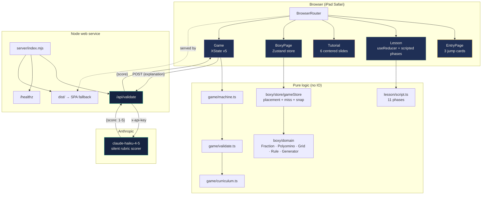
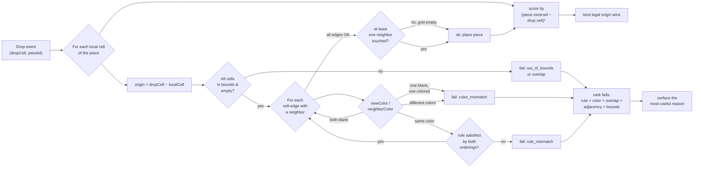
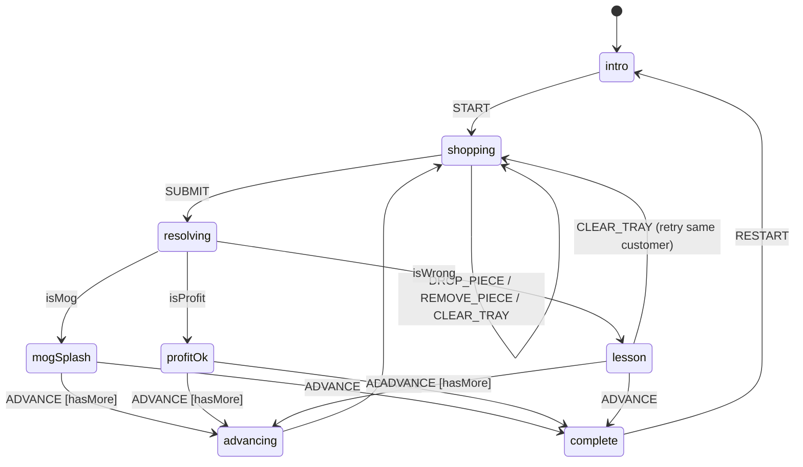
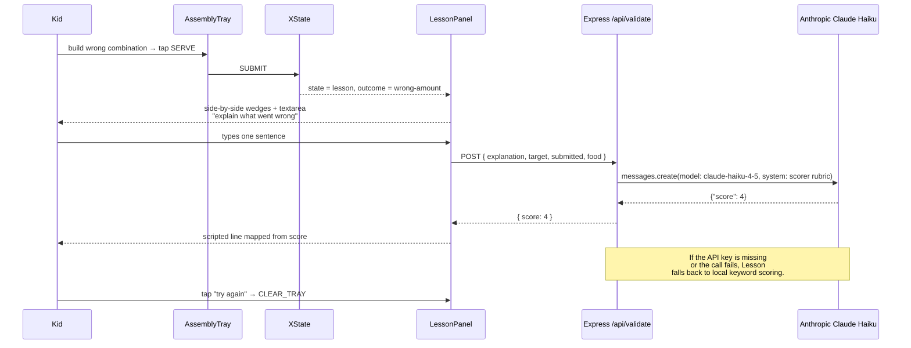

# Fraction Bazaar — Architecture

A single-page web app that teaches a 9-year-old fraction equivalence end-to-end. The user lands on a splash, walks a from-zero scripted lesson, takes a six-slide tutorial that explains the Boxy game, plays Boxy (polyomino placement with strict color rules), and then plays Trade Mogging (bazaar-vendor combo game with an LLM-scored remediation lesson on wrong serves). Each stage is a separate route inside one deploy.

This repo is the Gauntlet G5 Week 4 Synthesis hiring-partner submission.

## One-look topology



## Routes

| Path | Component | What it is |
|---|---|---|
| `/` | `EntryPage` | Splash + three jump cards: Tutorial, Boxy, Trade Mogging, plus a primary "Take the lesson" CTA. |
| `/lesson` | `Lesson` | 11-phase scripted lesson: parts of a whole → halves → quarters → naming → fraction notation → equivalence → bridge to Tutorial → bridge to Trade Mogging. |
| `/tutorial` | `Tutorial` | 6 full-page centered slides explaining Boxy: fill the grid, count badge, edge colors, color contract, misses, reset vs new round. |
| `/boxy` | `BoxyPage` | Polyomino placement game. Strict per-edge color contract. Snap-to-legal drop semantics. Reset + New round + Submit + Reveal answer. Live filled/possible/misses chip. |
| `/trade` | `Game` | Trade Mogging bazaar game. XState state machine, LLM-scored "explain what went wrong" panel on miss. One customer at a time. |
| `*` | `Navigate "/"` | Any unknown path redirects to the entry. The router is the single source of truth — a stray link is never a dead end. |

`SiteNav` is sticky on every route except `/` (the splash reads clean without chrome).

## Layered model

The code splits into three layers everywhere:

1. **Domain** — pure value objects with no UI awareness. `Fraction`, `Polyomino`, `Grid`, `Piece`, `Rule` in Boxy; `Fraction`, `Vendor`, `Customer`, `TrayPiece` in Trade. Every invariant lives here. The domain throws clear exceptions on misuse so a UI bug surfaces with a stack trace that names the offending call site.
2. **State** — the wrapper that owns the observable game state. Boxy uses Zustand (cheap, no provider, predictable selectors); Trade uses XState v5 (8 distinct screen states with event guards); Lesson uses a 30-line `useReducer` because its complexity does not warrant either library.
3. **UI** — React components that subscribe to slices of the state container. Components are deliberately dumb. They render and dispatch, nothing else.

No data fetching for any client-only flow. The only server endpoint is `/api/validate`, called once per missed Trade Mogging serve when the kid types an explanation.

## Three games, three state libraries (and why)

The three games made different state-management choices on purpose:

**Lesson — useReducer.** Eleven phases, each with a small bag of UI state (split count, fill count, chat-done flag, remediation string). A reducer with five action types covers it. Adding Zustand or XState here would be over-engineering for code that fits in one file.

**Boxy — Zustand.** The store holds `round`, `grid`, `trayPieceIds`, `messages`, four terminal-state flags, a miss counter, and a max-possible-fill ceiling. Many components subscribe to small slices (`useGameStore(s => s.missCount)`). Zustand's selector model fits this exactly. No event-graph complexity that would justify XState.

**Trade Mogging — XState v5.** Eight discrete screen states (`intro`, `shopping`, `resolving`, `mogSplash`, `profitOk`, `lesson`, `advancing`, `complete`) connected by event guards (`isMog`, `isProfit`, `hasMoreCustomers`). A state chart is the right tool here; rolling this with reducers would re-invent guarded transitions badly.

The unification cost is small — each game lives behind its own route, the libraries do not cross-pollinate, and TypeScript catches any accidental import.

## Boxy placement rules (strict color edge contract)



Two interlocking ideas:

**Snap-to-legal.** The drop cell is the cell under the pointer, not the piece's (0,0) origin. The store tries every local cell of the piece as the hot-spot (`origin = dropCell − localCell`) and picks the legal candidate whose piece-centroid lands closest to the drop cell. That eliminates the false "out of bounds" / "spot already taken" errors that fired when a multi-cell piece's top-left corner happened to land off-grid even though the visual drop was on a valid empty cell.

**Strict per-edge color contract.** Each cell-edge between the new piece and a neighbor must satisfy:

- both blank → no rule applies, edge OK
- one blank, one colored → reject (a colored edge cannot meet a blank one)
- both colored, different colors → reject
- both colored, same color → that color's specific rule must be satisfied by the box-count pair, in either ordering, with equivalent fractions counted (so 3:5 ≡ 5:3 ≡ 6:10 ≡ 9:15)

An earlier revision dropped color matching ("any rule that fits the count ratio works") to make placement easier. That let the player drop pieces wherever the math happened to land, even when the colors at the edge said something different — a 4-piece accepted next to a 6-piece on a 1:3-colored edge because 4:6 reduces to 2:3 (which IS a rule, just not THIS edge's rule). Restoring per-edge color match makes the math the actual gate.

**Tray drag-reveal.** Tray pieces are blank when idle. The moment the kid picks one up, colors reveal so they can plan placement under the strict edge contract. Drop or cancel returns the tray to blank. The static tray stays unbiased; the active drag is informative.

**Miss counter.** Every rejection bumps `missCount`. The toolbar's stat chip stays gray at 0 and tints honey above zero — soft pressure against brute-force drag-and-pray, not punishment. Resets on Reset and New round.

## Trade Mogging state machine (XState v5)



The machine is the only thing that mutates Trade Mogging state. UI components are pure renders of the machine's snapshot. `evaluateTrade(customer, tray)` in `validate.ts` is a pure function that returns one of `{mog, profit, wrong-amount, wrong-food}`. The cheapest-combo solver is a bounded BFS with pruning; the catalog tops at five piece types per food so DP would be over-tooling.

## Lesson advance contract

Each lesson phase declares one advance condition. The reducer dispatches on manipulative events and choice clicks; only the matching advance triggers a phase transition.

| Advance kind | Triggers next phase when... |
|---|---|
| `continue` | The Continue button is tapped (after chat finishes). |
| `tap-anywhere` | Any tap on the bar fires `onTapSplit`. |
| `split-twice` | `onTapSplit` reports ≥ 4 pieces (one tap on a half splits into fourths). |
| `choice` | A choice click reports `correct: true`. Wrong choices set a sticky remediation line and stay. |
| `bar-filled` | The compare-bar's filled-count reaches its target. |
| `jump-out` | The advance button issues `navigate(route)` instead of a phase transition. |

Bridge phases at the end of the lesson navigate to `/tutorial` then `/trade`, so the kid walks the whole flow exactly once and exits into the third game without ever bouncing back to the splash.

## Data flow on a missed Trade Mogging serve



The kid never sees the LLM's prose. The frontend maps the integer 1-5 score to one of five pre-written scripted responses. This satisfies the Synthesis brief's rule that LLM text is never exposed directly — we use the LLM's pedagogical judgment, not its writing.

If the network call fails or `ANTHROPIC_API_KEY` is unset, the client falls back to keyword-based local scoring so the lesson still functions. Rate limit: 60 calls/minute per IP, enforced in `server/index.mjs`.

## Server (Render web service)

The Express server in `server/index.mjs` has three jobs:

1. Serve the Vite-built SPA from `dist/` with long-cache headers on `/assets/*`. Falls back to `index.html` for any non-API GET so deep-links resolve.
2. Own `POST /api/validate`. Reads `ANTHROPIC_API_KEY` from the process environment, calls Anthropic's `/v1/messages` with the silent-scorer system prompt, returns only `{ score: 1-5 }`.
3. Expose `GET /healthz` for Render's health check. Reports `{ ok, ts, anthropicKey: boolean }`.

Defense-in-depth on the parser: strict JSON first, regex on `"score": N` next, single-digit anywhere last. Three attempts before the endpoint returns 500 and the client gracefully degrades to keyword fallback.

## Decisions

| Decision | What we chose | Alternative | Why |
|---|---|---|---|
| Unified vs separate apps | One Render service, four routes | Three separate deploys cross-linked | One URL for evaluators, one deploy to manage, one set of dependencies. `BrowserRouter` + SPA fallback in Express gives deep-links without a CDN-router product. |
| Math representation | Integer rational (`{num, den}`) | JS `number` | A kid combining `1/3 + 1/3 + 1/3` must yield exactly 1, never 0.9999. Float drift would fire wrong-amount on a correct answer. |
| State management — Boxy | Zustand | useReducer, XState | Many small slice subscribers, no event-graph complexity. Zustand's selector model fits exactly. |
| State management — Trade | XState v5 | useReducer | 8 distinct screen states with event guards (`isMog`, `isProfit`, `hasMoreCustomers`); a state chart is the right tool. |
| State management — Lesson | useReducer | Zustand, XState | 30 lines of state and 5 action types. Adding a library would be over-engineering. |
| Boxy edge contract | Strict same-color match + per-color rule | Any rule that fits the count ratio | Field reports of 4-piece accepted next to 6-piece on a 1:3 edge because 4:6 reduces to 2:3. Strict per-edge match makes the math the actual gate. |
| Drag drop hot-spot | Snap-to-legal origin (centroid heuristic) | Drop = piece (0,0) | Players were dropping the visual center of a multi-cell piece on a valid empty cell and getting "out of bounds" because the (0,0) corner landed off-grid. |
| Tray colors | Hidden when idle, revealed on drag | Always visible | Static tray stays unbiased (no shape-and-color scanning). Active drag is informative under the strict edge contract. |
| Tutor — Lesson | Scripted, no LLM | LLM-generated | Engelmann Direct Instruction demands faultless examples and unambiguous progress. The lesson IS the teacher; the LLM is the silent rubric scorer for Trade Mogging only. |
| Tutor — Trade | Silent LLM scorer + 5 pre-written replies | LLM prose to the kid | Synthesis brief: LLM text never exposed directly. The LLM's pedagogical judgment is used; its prose is not. |
| Drag/drop library | `@dnd-kit/core` for Trade, Framer Motion for Boxy | One library | Trade uses `@dnd-kit` because it landed first; Boxy uses Framer because it ships with `dragSnapToOrigin` which the snap-to-legal flow uses. Pluralism cost is one extra dependency. |
| Deploy | Render Node Web Service | Vercel, Netlify, Cloudflare Pages | Server-side API key for `/api/validate` rules out static-only platforms. Render Pro plan avoids cold-start on the demo URL. |
| Routing | `react-router-dom@7` BrowserRouter | HashRouter, file-based router | BrowserRouter + Express SPA fallback gives clean URLs without a per-route SSR bundle. Deep links work after refresh. |

## Trade-offs

**Three state libraries inside one app.** Zustand for Boxy, XState for Trade, useReducer for Lesson. The pluralism is intentional — each library fits its game's state shape — but onboarding a new contributor takes longer than a single-library codebase. Mitigated by keeping each game's state behind its own route and exporting no state across the boundary.

**Boxy tests are not yet wired in this repo.** The standalone `boxy-fractions` repo has a Vitest suite (Fraction tests, gameStore tests pinning the qa-adversary terminal-state contract). Porting Vitest into this repo is a follow-up; until then, the boxy-fractions repo retains the test source of truth for the domain layer.

**No persistence.** A kid who closes the tab and comes back starts fresh. The off-ramp principle wins (Skinner): a paused lesson is a finished lesson. Adding persistence is a v1.1 concern; if a parent wants to save progress, that has its own design implications around login.

**Anthropic API key gating Trade Mogging's lesson rubric.** If the key is unset, the lesson degrades to keyword fallback. The endpoint returns a clear error so monitoring catches the misconfiguration immediately, but until the key lands the rubric is coarser.

**Static character art still looks placeholder.** The hand-drawn SVGs (`art/Animals.tsx`, `art/Food.tsx`) carry the bazaar's design rules but were called out by the user as needing polish. The Cowork MCP registry does not include a text-to-image generator; richer art would need a Replicate / Fal.ai / DALL-E MCP installed at the Claude Desktop level. Open work for v1.1.

**Lesson bar manipulative is tap-only, not drag.** A drag-drop bar would feel more tactile but doubles the implementation surface (touch sensors, hit testing, snap behavior). Tap-to-split + tap-to-deposit covers the same pedagogy with one event type. Re-evaluate on iPad after first cohort tests.

## Tech stack

- Vite + React 19 + TypeScript (strict)
- Tailwind CSS 3 (utilities only, no custom stylesheet beyond `index.css`)
- react-router-dom 7 (BrowserRouter + SPA fallback)
- XState 5 (`@xstate/react`) — Trade Mogging
- Zustand 5 — Boxy
- @dnd-kit/core 6 — Trade Mogging drag/drop (iPad touch sensors)
- Framer Motion 12 — Boxy drag/drop (`dragSnapToOrigin`)
- Tone.js 15 — sound effects (Trade)
- Express 4 on Node 20 (`server/index.mjs`)
- Render Node Web Service — single deploy, single URL
- Anthropic Claude Haiku 4.5 — silent rubric scorer (Trade only)

## File map

```
src/
├── App.tsx                       BrowserRouter + Routes
├── main.tsx                      React 19 root mount
├── index.css                     Tailwind directives + base resets
├── components/                   route-level components
│   ├── EntryPage.tsx
│   ├── Lesson.tsx                useReducer + phase reducer
│   ├── Tutorial.tsx              6 centered slides, SVG art
│   ├── BoxyPage.tsx              wraps boxy/ui
│   ├── Game.tsx                  XState machine wrapper (Trade)
│   ├── AssemblyTray.tsx          (Trade)
│   ├── CashStack.tsx             (Trade)
│   ├── CustomerCard.tsx          (Trade)
│   ├── VendorStall.tsx           (Trade)
│   ├── LessonPanel.tsx           (Trade — wrong-serve rubric)
│   ├── MogSplash.tsx             (Trade — mog animation overlay)
│   ├── ProfitSplash.tsx          (Trade — profit overlay)
│   └── SiteNav.tsx               sticky top-of-page nav
├── lesson/
│   ├── script.ts                 11 phases × chat × manipulative × advance
│   ├── LessonChat.tsx            cadence-animated tutor lines
│   └── BarManipulative.tsx       tap-split + compare-bars renderer
├── boxy/
│   ├── domain/                   Fraction, Polyomino, Grid, Piece, Rule, Generator
│   ├── store/gameStore.ts        Zustand store + snap-to-legal + miss counter
│   └── ui/                       GridView, Tray, PieceView, Toolbar, RulesPanel,
│                                 MessagesPanel, DraggablePiece, AdjacencyGlow,
│                                 dropTargets, sizing
├── game/                         Trade Mogging pure logic
│   ├── machine.ts                XState v5
│   ├── validate.ts               evaluateTrade + cheapestCombination
│   ├── curriculum.ts             vendors + customers
│   ├── fraction.ts               integer rational math (Trade)
│   ├── sound.ts                  Tone.js sting + thock
│   └── types.ts
└── art/                          hand-drawn SVG illustrations
    ├── Animals.tsx
    └── Food.tsx

server/
└── index.mjs                     Express + /api/validate + /healthz + SPA fallback

docs/                             ARCHITECTURE.md, AI_INTERVIEW_PREP.md,
                                  ATOMIZATION.md, BOXY_SPEC.md,
                                  DEFENSE_BREAKOUT_SCRIPT.md,
                                  IPAD_ROADMAP.md, MANUAL_TESTS.md

website/index.html                this doc as a single-page website
render.yaml                       Blueprint for the Node web service
```
