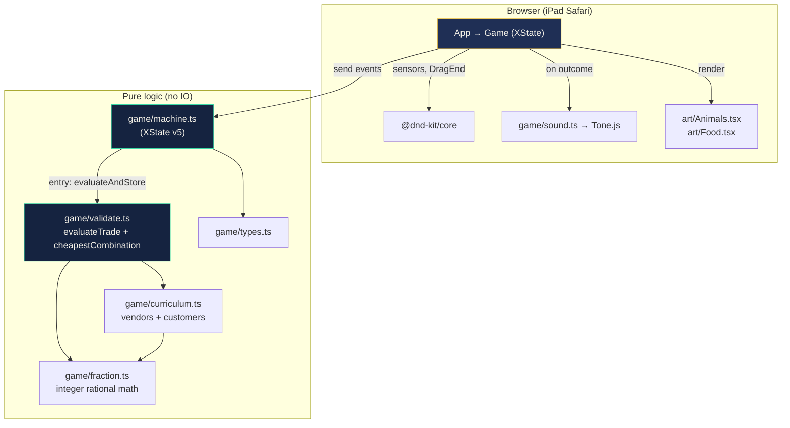
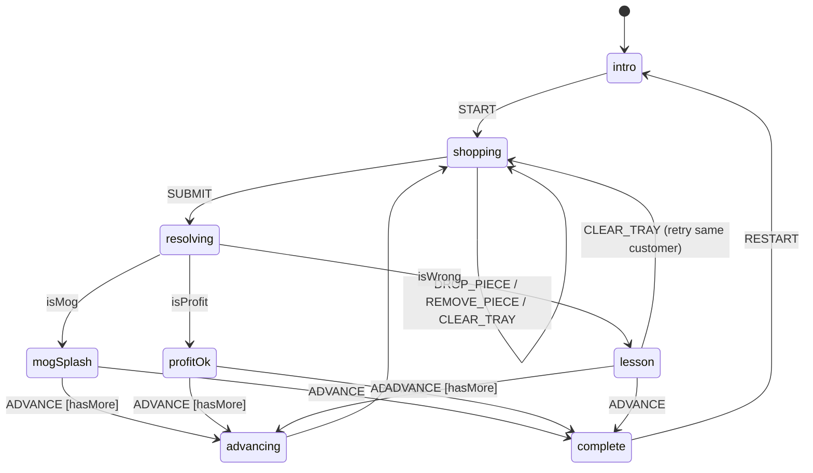
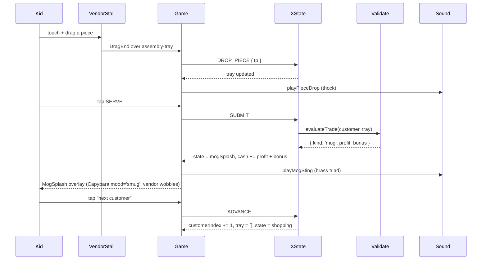

# Trade Mogging — Architecture

Single-page React iPad-browser game where the kid plays a capybara at a Middle-Eastern night bazaar. They combine fraction pieces from vendor stalls to fulfill customer orders, profit when correct, and "mog" the vendor (cheapest possible combo) for a bonus. Fraction equivalence is the strategy because the same customer order can be fulfilled by several distinct combinations of vendor pieces, and the cheapest one almost always uses an equivalence the kid had to see.

## One-look topology

## State machine (XState v5)

The machine is the only thing that mutates state. UI components are pure renders of the machine's snapshot.

## Data flow for a successful trade

## Why scripted, not LLM

The brief explicitly permits scripted dialogue. More importantly, Synthesis's own product FAQ says "we do not simply outsource your child's education teaching to an LLM." A LLM-driven tutor for a 9-year-old has seven distinct failure modes (inappropriate content, validating wrong answers, math errors on fractions, topic drift, latency, cost handling, voice mismatch) that all evaporate when the dialogue is authored. The lesson reads as smart because the curriculum is atomized (see `docs/ATOMIZATION.md`), not because a model is improvising.

## Decisions

| Decision | What we chose | Alternative | Why |
|---|---|---|---|
| Game framing | Bazaar arbitrage | Lesson-style guided exploration | Pizzas are what the cohort is building; vendor arbitrage routes math equivalence directly into the strategy. |
| Math representation | Integer rational (`{num, den}`) | JS `number` | A kid combining `1/3 + 1/3 + 1/3` must yield exactly 1, never 0.9999. Float drift would fire wrong-amount on a correct answer. |
| State management | XState v5 | useReducer | The game has 8 distinct screen-states and event guards (`isMog`, `isProfit`, `hasMoreCustomers`); a state chart is the right tool. |
| Drag/drop | `@dnd-kit/core` | Native HTML5 DnD, react-dnd | dnd-kit handles touch on iPad Safari out of the box. HTML5 DnD does not. |
| Tutor | Silent + on-demand (Hint button) | Always-on coaching | Per user preference and Skinner's competence-is-the-motivator principle; the lesson speaks via gameplay feedback, not character dialogue. |
| Animal art | Hand-drawn SVG | Stock illustrations | Tight visual identity, no licensing, every animal communicates a "vibe" (camel's flat cap, goat's sunglasses, buffalo's nose ring). |
| Validation | Pure function `evaluateTrade` | Methods on a Game class | Testable in isolation, no hidden state, machine is the only mutator. |
| Cheapest-combo solver | Bounded BFS with pruning | Dynamic programming | Catalog tops at 5 piece types per food; DP would be over-tooling. |
| Deploy | Render Node Web Service (public-URL Blueprint) | Vercel, Netlify, Cloudflare Pages | Render Pro avoids cold-start; single service hosts SPA + `/api/validate`; public-URL Blueprint sidesteps the GitHub-integration cost of expanding org access. |

## Trade-offs

**The kid can game the score by always picking the single largest piece.** Some customer orders allow this (1/2 of pita = one 1/2 piece from Camel). We accept the trade because the next customer's order is usually 3/4 or 5/8, where no single piece works and equivalence becomes mandatory.

**Cash can go negative in spirit but is clamped at $0.** The brief is for a 9-year-old; a "$-3.50" reading would be confusing and discouraging. We clamp at $0 in the reducer. The trade-off is that a kid who fails six in a row sees zero forever and may rage-quit, but six failures with the on-demand Hint button is already a curriculum bug.

**Bebas Neue is loaded from Google Fonts.** External font fetch adds one network round trip on cold start. We accepted it for the bazaar-sign typography it lights up. System fallback covers the time until the font lands.

**No persistence between sessions.** The off-ramp principle wins (Skinner). A kid who leaves the tab and comes back starts fresh. If a parent wants to "save progress" later, that is a v1.1 concern.

## Tech stack

- Vite + React 19 + TypeScript
- Tailwind CSS 3
- XState 5 (`@xstate/react`)
- @dnd-kit/core (touch-friendly drag-and-drop)
- Tone.js 14 (Tone.PolySynth / MembraneSynth / MonoSynth)
- Framer Motion 11 (reserved for v1.1 polish)
- Express on Node 20 (`server/index.mjs`) — serves the SPA from `dist/` and owns `POST /api/validate`
- Render Node Web Service (manual sync from public-URL Blueprint)
- Anthropic Claude Haiku 4.5 (silent rubric scorer)
