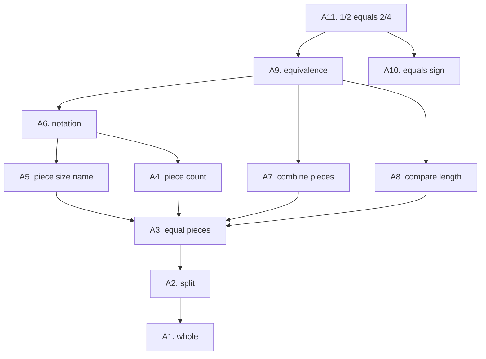

# Clone Synthesis Tutor — Knowledge-Tree Atomization

Source of truth for every tutor utterance and every wrong-answer branch. The XState scripted tutor and the manipulative both reference atoms by id. If a branch in the lesson script does not name an atom, the branch is wrong.

This doc is the project's differentiator. Most week-4 cohort submissions will be a chat box plus a draggable rectangle. Ours has a verifiable mapping from every reachable state to a specific sub-skill, in the tradition of Siegfried Engelmann's Direct Instruction ("all details of instruction must be controlled to minimize the chance of students' misinterpreting the information being taught") and Patrick Skinner's cognitive-load framework ("every visual element must serve a pedagogical purpose").

Target learner: a third grader who can count and can compare lengths visually, and who has seen the words "half" and "quarter" but has not been taught fraction notation rigorously.

## The atoms

Each atom has an id, a one-sentence definition, the kid-visible behavior the manipulative must afford, and the *known misconception* a kid this age brings to the moment.

| id | definition | manipulative affordance | known misconception |
|---|---|---|---|
| `A1.whole` | A bar can represent one whole thing. | One full-width bar visible from frame zero, labeled "1 whole." | "Whole" means "any amount." (No. A whole here is *this* specific bar.) |
| `A2.split` | A whole can be split into pieces. | Tap the bar, it splits in half along a clean vertical line. Two pieces. | Splits are random sizes. (No. The split is exactly down the middle.) |
| `A3.equal_pieces` | When a whole is split fairly, all pieces are the same size. | The two halves are visually identical. Tap-to-measure shows equal lengths. | Pieces are equal "ish." (No. They are *exactly* equal. The visual must read as identical to the eye.) |
| `A4.piece_count` | You can count the pieces. | Pieces are countable. Tap-and-hold reads the count aloud. | Counting is about the total amount. (No. Here counting is about how many pieces, not how much stuff.) |
| `A5.piece_size_name` | Each piece has a name based on how many pieces the whole was split into. | A 2-split piece reads "1/2 (one half)." A 4-split piece reads "1/4 (one fourth)." | "Bigger number means bigger piece." (No. Bigger denominator means *more* pieces, which means *smaller* pieces.) |
| `A6.notation` | A fraction is written numerator over denominator: count over size-name. | The label "1/2" appears under a single half. The label "2/4" appears under two quarters. | "1/2 is the number one and the number two." (No. It is a single number describing an amount.) |
| `A7.combine_pieces` | Two pieces of the same size combine into a larger amount equal to two-of-that-size. | Drag two 1/4 blocks onto each other; the smash animation produces a single 1/2 block. | Combining changes the size of each piece. (No. The pieces stay the same; only how-many-of-them changes.) |
| `A8.compare_length` | Two amounts can be compared by lining them up edge to edge. | Pieces snap to a shared baseline. The kid can see whether two arrangements are the same length. | Things on top of each other can't be compared. (No. Alignment to a baseline is the comparison move.) |
| `A9.equivalence` | Two different fraction names can describe the same amount. | A 1/2 block stacked above two 1/4 blocks shows identical length. The equals sign lights up between them. | "If they look different, they are different." (No. 2/4 is *written* differently from 1/2 but is *the same amount*.) |
| `A10.equals_sign` | The equals sign means "same amount," not "becomes." | The "=" between 1/2 and 2/4 is a static glyph, not an arrow. Tap it to read "the same amount as." | "= means the answer goes on the right." (No. Equals is symmetric: same amount on both sides.) |

## The tree (Mermaid)

The lesson teaches bottom-up: whole, split, equal pieces, count, size name, notation, combine, compare, equivalence, equals. The root concept (`A11`, "1/2 = 2/4") is not its own atom; it is what emerges once every leaf below it is solid.

## Wrong-answer branches: misconception → remediation

Every reachable wrong-answer state in the XState machine corresponds to one row in this table. The remediation script is *one sentence* plus a manipulative nudge. Engelmann: minimize misinterpretation. Skinner: every visual element must serve a pedagogical purpose.

| trigger (what the kid did) | misconception atom | tutor remediation script | manipulative nudge |
|---|---|---|---|
| Tapped a piece and called it "two halves" when it was a quarter | `A5.piece_size_name` | "Look at how many pieces the bar got split into. Four pieces means we call each one a *fourth*, not a half." | Highlight all four pieces briefly, then highlight just one with "1/4" floating above it. |
| Said 2/4 is bigger than 1/2 because "4 is bigger than 2" | `A5.piece_size_name` | "When the bottom number gets bigger, the pieces get *smaller*. Four pieces of the same bar are smaller than two." | Side by side: bar split into 2 vs bar split into 4. Both bars are identical width; the pieces in the 4-split are visibly half the size. |
| Tried to drag a 1/4 block onto a 1/2 block expecting them to "fit together" | `A3.equal_pieces`, `A7.combine_pieces` | "Pieces only combine when they are the same size. Try combining two pieces that look exactly alike." | Snap-back animation. The 1/4 floats back to its row. The two 1/4 blocks pulse gently. |
| Combined two 1/4 blocks but said the result is "1/8" | `A7.combine_pieces` | "When two pieces combine, the *size* of each piece doesn't change. Two quarter-pieces make the same amount as one half." | The smash animation re-plays at half speed. The 1/2 label fades in over the combined block. |
| Said 1/2 and 2/4 are not equal because "they look different" | `A8.compare_length`, `A9.equivalence` | "They are written differently, but watch what happens when we line them up edge to edge." | The two arrangements slide to share a baseline. A faint vertical line drops at each end to show identical width. |
| Said 1/2 "becomes" 2/4 (treats = as an arrow) | `A10.equals_sign` | "The equals sign doesn't mean 'turns into.' It means 'the same amount as.' You could read it left to right or right to left." | The "=" sign briefly pulses. A whisper-quiet voice label reads "the same amount as." |
| Tapped a half-piece and called it "a fraction" without specifying | `A4.piece_count`, `A5.piece_size_name` | "A fraction has two parts: how many pieces, and what size each piece is. This one is *one* piece, and it's a *half*-sized piece. So we say one half." | The numerator "1" highlights, then the denominator "2" highlights, with a slight delay. |
| Confused about the notation 1/2 vs the words "one half" | `A6.notation` | "These mean the exact same thing. The number on top is how many. The number on the bottom is the size-name." | The fraction label "1/2" and the spoken label "one half" both animate in together. |
| Tapped the bar and expected an animal or character to appear | (none, but flag for design review) | (no script. The bar splits silently. No character ever appears.) | The bar splits cleanly. No animation easter eggs. |

That last row is the "no fantasy" guardrail. A 9-year-old who has used a lot of edutainment may *expect* a talking pencil. We refuse to give one, on purpose, per the Hinten 2025 meta-analysis cited in Skinner's piece: fantastical content costs working memory and hurts learning.

## How the lesson uses the atoms

Three phases. Each phase teaches some atoms in isolation, then integrates them upward.

**Explore phase (90 seconds, mostly silent).** Atoms `A1`, `A2`, `A3`, `A4`. The kid taps and pokes. The tutor speaks once: "Try splitting one of the pieces. See what happens." No questions yet.

**Instruct phase (~2 minutes).** Atoms `A5`, `A6`, `A7`, `A8`, `A9`, `A10`. The tutor asks four questions in sequence, each gated on the previous one being right. The smash gesture is introduced and rewarded here. Any wrong answer routes to the remediation in the table above, then loops back to the same question with the manipulative pre-set to make the right answer visible.

**Check phase (~60 seconds, three problems).**
1. "Show me 1/2 by combining smaller pieces." Acceptable: two 1/4 blocks combined. Atom `A7` integrated with `A9`.
2. "Look at this." (Display two 1/4 blocks on the left, one 1/2 block on the right.) "Are these the same amount?" Acceptable: yes. Atom `A9` solo.
3. "Now combine four 1/8 blocks to make 1/2." Acceptable: four 1/8 blocks dragged and smashed in pairs into 1/4s, then again into 1/2. Atom `A7` chained twice. (This is the *transfer* check, in Skinner's terms: did the kid generalize beyond the literal 1/2 = 2/4 they just saw?)

After all three are right, the lesson ends. One quiet beat of visual affirmation, the words "You got it. 1/2 and 2/4 are the same amount." Lesson over. The off-ramp.

## What this doc does *not* try to do

- It does not enumerate every wrong move a kid could make. It enumerates the wrong moves whose remediation requires a different script. A kid who taps the wrong block by accident does not need a remediation; the manipulative just rejects the action.
- It does not anticipate gaming behavior (a kid trying to "break" the app). The brief target is a kid who is engaging in good faith. Adversarial behavior is for the iPad QA pass.
- It does not extend beyond `A11`. If we had three weeks, we'd add 1/3 = 2/6, 3/6 = 1/2, simplifying fractions, etc. We have five days. The scope is one equivalence.

## What downstream consumers do with this doc

- **The lesson script (`docs/research/LESSON_SCRIPT.md`)** copies the remediation column verbatim into XState machine transitions.
- **The XState machine (`src/state/tutor.machine.ts`)** names every state with the atom id it teaches or remediates.
- **The README** cites this doc as the "design rigor" anchor.
- **The defense breakout script** uses the misconception-to-remediation table as the proof that the design is grounded in pedagogy, not vibes.
- **The AI interview prep** uses the named atoms as concrete examples when answering "give me a specific case where you handled a wrong answer."
